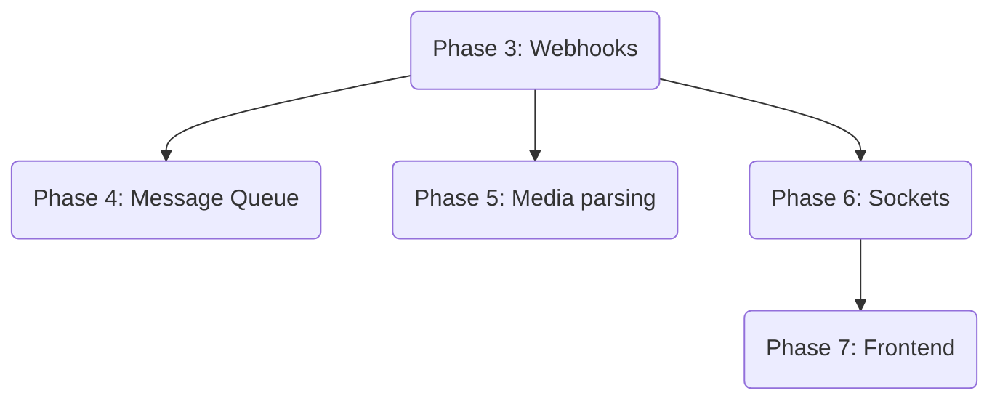

# WhatsApp Dashboard Tasks

**Branch**: `001-whatsapp-dashboard`
**Date**: 2026-04-10
**Spec**: `/specs/001-whatsapp-dashboard/spec.md`

## Implementation Strategy
We will implement the foundation first (Phase 1 & 2), ensuring Database schemas and Docker environments are stable. We then MVP the core WhatsApp inbound/outbound sequence, finishing with real-time feedback and frontend implementation.

## Phase 1: Setup

- [ ] T001 Initialize Node.js backend workspace in `backend/package.json`
- [ ] T002 Initialize Next.js frontend workspace in `frontend/package.json`
- [ ] T003 Set up Next.js UI libraries (shadcn/ui, Tailwind CSS) in `frontend/`
- [ ] T004 [P] Create Dockerfiles and `docker-compose.yml` for infrastructure in `/`

## Phase 2: Foundational

- [ ] T005 Initialize Prisma ORM schema mirroring data-model.md in `backend/src/db/prisma/schema.prisma`
- [ ] T006 Scaffold basic Express server and Redis client in `backend/src/server.ts`

## Phase 3: Receive Messages [US1]

**Goal**: Successfully accept, verify, and parse Meta webhook payloads.
- [ ] T007 [US1] Create Webhook Verification endpoint `GET /webhook` in `backend/src/api/webhooks.ts`
- [ ] T008 [US1] Create Webhook Receiver `POST /webhook` and implement parsing logic in `backend/src/api/webhooks.ts`
- [ ] T009 [US1] Implement User and Conversation upserting queries in `backend/src/services/whatsapp.ts`
- [ ] T010 [US1] Implement Message persisting logic based on webhook push in `backend/src/services/whatsapp.ts`

## Phase 4: Send Messages [US2]

**Goal**: Expose an internal API to reliably push messages to users complying with the 24-hr rule.
- [ ] T011 [US2] Initialize BullMQ queue connection for reliable sending in `backend/src/queues/bullmq.ts`
- [ ] T012 [US2] Enforce 24-hour verification logic comparing `last_message_at` in `backend/src/services/whatsapp.ts`
- [ ] T013 [US2] Create Meta API request utility (`POST /messages`) using `axios`/`fetch` in `backend/src/services/whatsapp.ts`
- [ ] T014 [US2] Wire internal Send Message API `POST /api/messages/send` to BullMQ producer in `backend/src/api/messages.ts`

## Phase 5: Media Handling [US3]

**Goal**: Automatically intercept media messages and fetch their physical locations via Meta graph.
- [ ] T015 [US3] Create dedicated BullMQ media download job processor in `backend/src/queues/media_processor.ts`
- [ ] T016 [US3] Create utility to query `/v18.0/{media_id}` and persist the resulting image buffer or URL in `backend/src/services/media.ts`

## Phase 6: Real-Time Sync [US4]

**Goal**: Push Database state to Frontend securely.
- [ ] T017 [US4] Bind Socket.io to Express listener in `backend/src/websocket/socket.ts`
- [ ] T018 [US4] Inject socket emit function inside webhook parsing (`new_message` event) in `backend/src/api/webhooks.ts`
- [ ] T019 [P] [US4] Configure `socket.io-client` hook wrapper in `frontend/src/lib/socket.ts`

## Phase 7: Frontend Interface [US5]

**Goal**: Construct the User Interface for displaying real-time chats.
- [ ] T020 [US5] Create Chat List Sidebar representing open conversations in `frontend/src/components/chat/ChatList.tsx`
- [ ] T021 [US5] Create Chat Area showing text bubbles connected to websocket in `frontend/src/components/chat/ChatWindow.tsx`
- [ ] T022 [US5] Construct message input executing `POST /api/messages/send` in `frontend/src/components/chat/ChatInput.tsx`

## Phase 8: Polish
- [ ] T023 Setup global backend logger for explicit troubleshooting
- [ ] T024 Unify `.env.example` configurations.

---

## Dependencies

